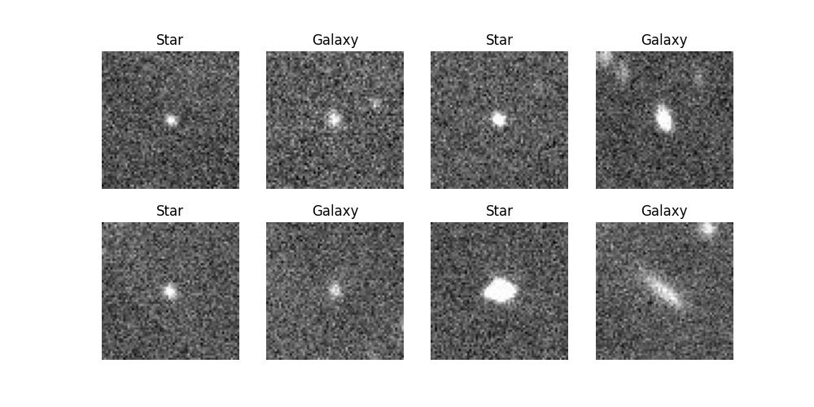
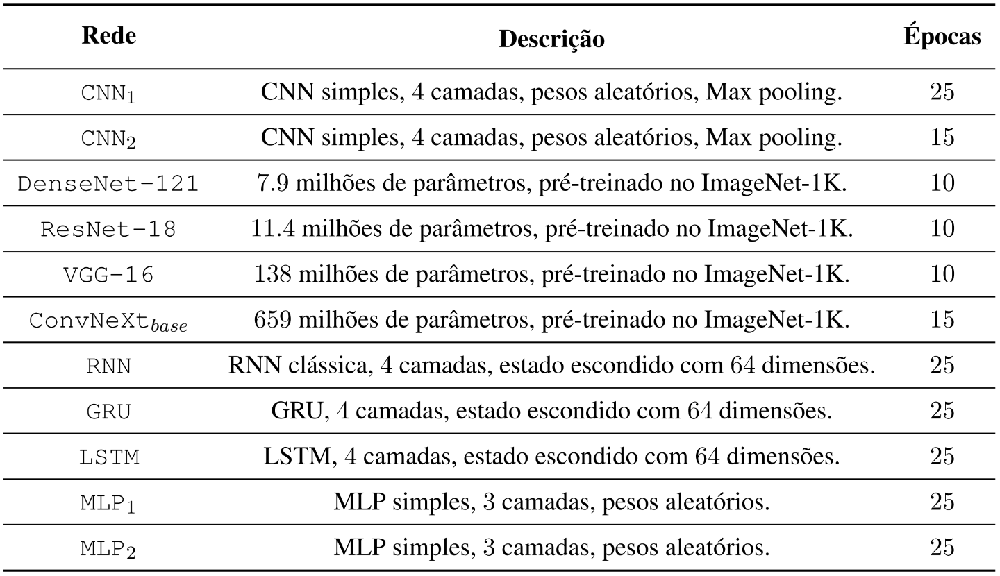
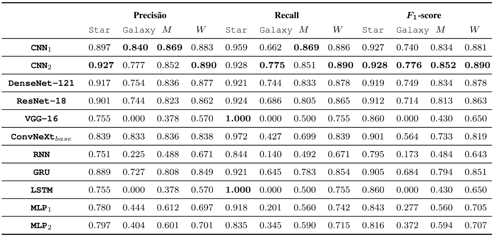

<h1 align="center">
  Classificação de Estrelas e Galáxias através de ANNs
</h1>

<h4 align="center">Esse repositório contém um projeto de classificação de estrelas e galáxias a partir de imagens de satélite, desenvolvido na disciplina Redes Neurais do curso de Ciência da Computação da UFRPE (2023.1).</h4>

<p align="center">
  <a href="#overview">Overview</a> •
  <a href="#como-utilizar">Como Utilizar</a>
</p>



## Overview

Esse repositório contém a implementação das seguintes redes utilizando PyTorch:




O dataset original foi divido em splits de *treinamento* (~70%) e *testes* (~30%). Todas as redes foram avaliadas no mesmo conjunto de testes, os principais resultados se encontram na tabela abaixo (M = *macro average*, W = *weighted average*).



## Como Utilizar

Primeiro, devemos instalar as dependências e preparar o ambiente para execução dos códigos.

```bash
# Clonar o repositório
$ git clone https://github.com/moesio-f/ann-star-galaxy-classification

# Acessar o repositório
$ cd ann-star-galaxy-classification

# Configurar as dependências
$ python -m venv .venv
$ source .venv/bin/activate
$ pip install -e .
```

Depois, podemos acessar os Jupyter Notebooks:

- [Main](main.ipynb): principal, contém o treinamento e avaliação das diferentes redes implementadas.
- [Dataset](dataset.ipynb.ipynb): contém uma breve exploração do dataset considerado.

